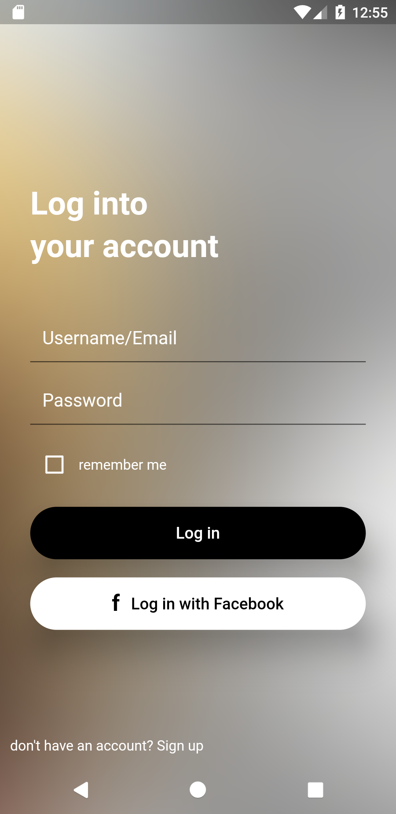

## Flutter Beautiful Login Page UI Design 

This repo is our repo in github , follow us ❤.

### cover


## Development Setup
Clone the repository and run the following commands:

```
flutter pub get
flutter run
```
## ScreenShots




<br><br>
[Watch it on Youtube](https://youtube.com)


- [Lab: Write your first Flutter app](https://flutter.dev/docs/get-started/codelab)
- [Cookbook: Useful Flutter samples](https://flutter.dev/docs/cookbook)

For help getting started with Flutter, view our
[online documentation](https://flutter.dev/docs), which offers tutorials,
samples, guidance on mobile development, and a full API reference.
